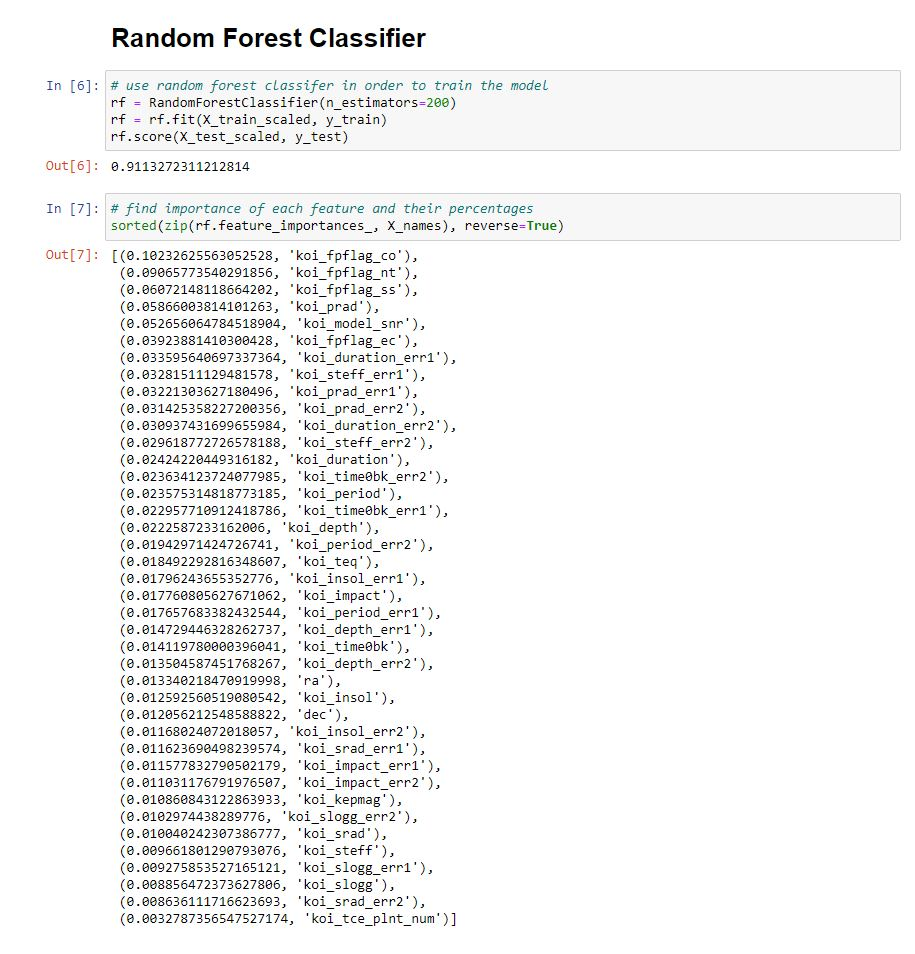
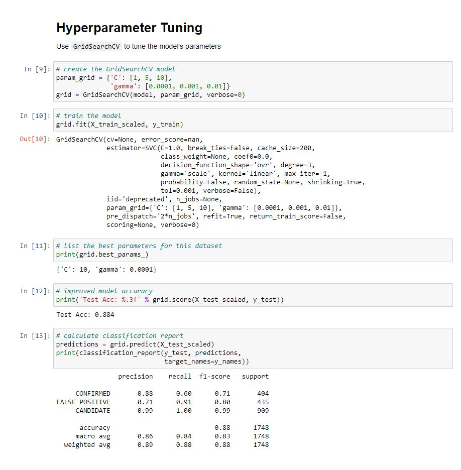
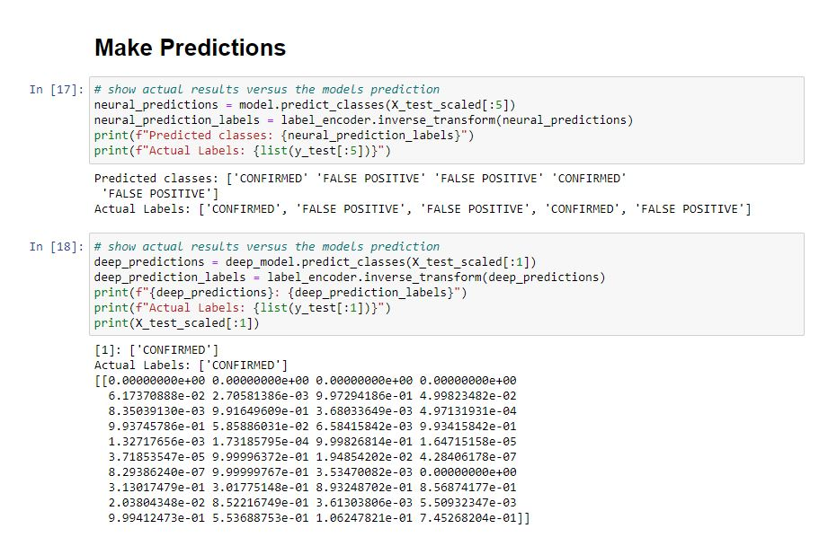

# Planetary Data

# Utilization of Machine Learning
Our experiment began with the utilization of a random forest classifier as a base in order to understand how each variable affected the distribution and weight of each new exoplanet. 

With this breakdown, we were then able to apply what we learned to an SVM model in order to train our machine to learn and explore new planets based on the information that we are given.

Once the model was trained, we used a grid search in order to hyper-tune each model which brought our results from 85.6% to an 88.4% accuracy. 

In order to tune our model even further, we applied deep learning in order to increase the percentage accuracy of predicting new exoplanets.

